

# Active Directory Deployed in the Cloud (Azure)
This tutorial outlines the implementation of Active Directory within Azure Virtual Machines.

## Environments and Technologies Used

- Microsoft Azure (Virtual Machines/Compute)
- Remote Desktop
- Active Directory Domain Services
- PowerShell

## Operating Systems Used 

- Windows Server 2022
- Windows 10 (21H2)

## Let's create our Azure resources

1. Create the Domain Controller VM (windows server 2022) named "DC-1"
  - Take note of the Resource Group and Virtual Network (Vnet) That gets created
2. Set the Domain Controller's NIC Private IP address to be static

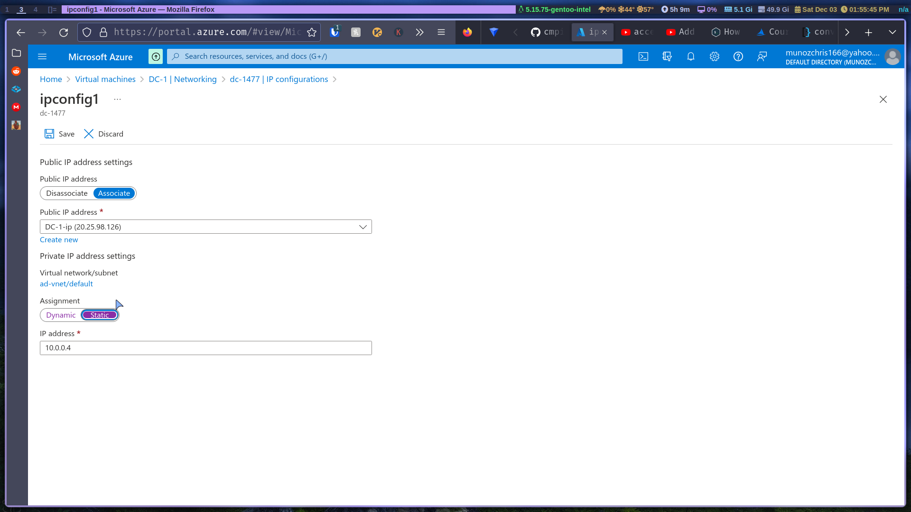
*Static IP setting*

3. Create the client VM (windows 10) named "client-1" Use the same Resource group and Vnet that was created
4. Ensure both VMs are in the same Vnet

## Ensure connectivity between the client and domain controller

5. Login to client-1 with RDP and ping DC-1's private IP with ping -t 
6. Login to the domain controller and enable ICMPv4 in the local windows firewall (access firewall settings by typing wf.msc in start menu)
 - go to inbound rules, sort by protocol and enable the two ipv4 ICMP rules
 - The picture below highlights the two rules you need to enable

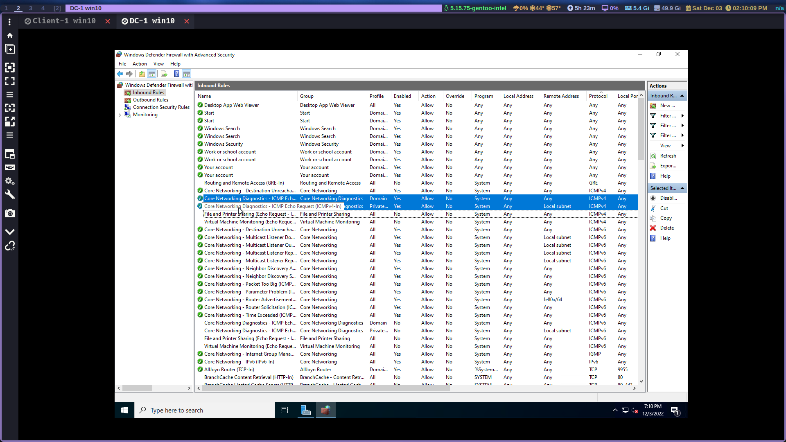
*ICMP Firewall setting*

7. Check back at Client-1 to see the ping succeed

## Install Active Directory

8. Login to DC-1 and install Active Directory Domain Services
  - Open up server manager and go to add roles and features
  - On the server roles make sure you select the correct Active Directory
  - Then click next and accept the defaults

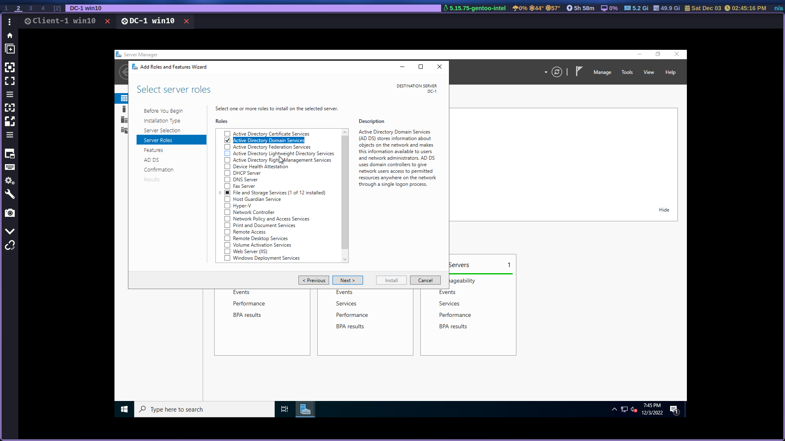
*Check this AD*

9. Promote as a DC: Setup a new forest as mydomain.com (this can be anything)
  - you'll find this option in the yellow exclamation point on the server dashboard
  - Click promote this server to a domain controller
  - Then click add a new forest, add your domain and click next all the way through to stick with the defaults

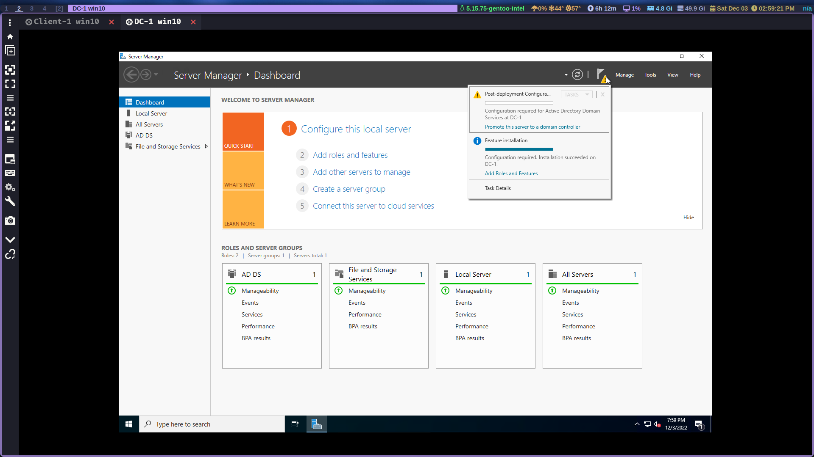

10. Once it's installed the server will restart and then log you out, log back into DC-1 as user: mydomain.com\user
  - Now we wait for the settings to apply, if you see the screen below don't panic, it just takes a while to log you back in

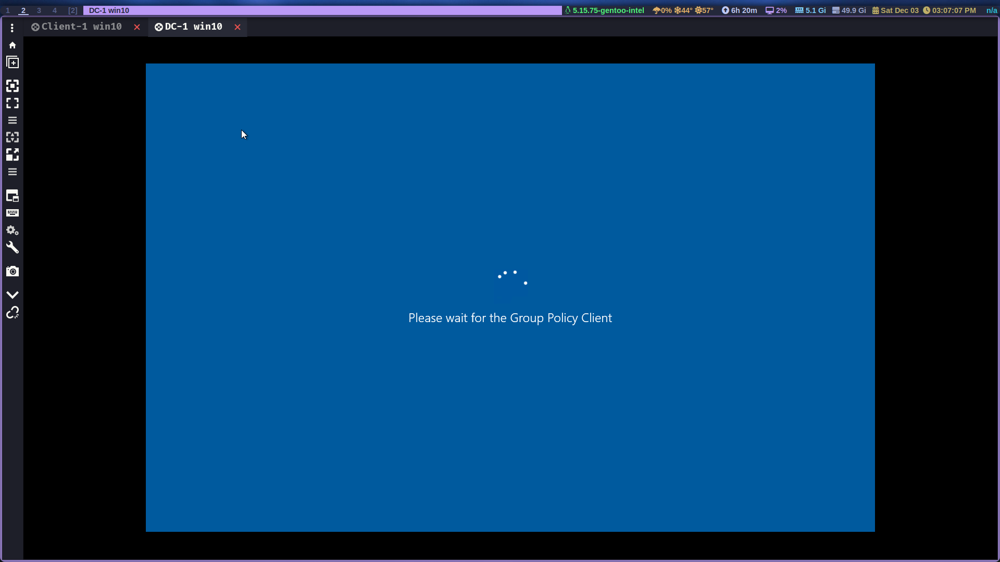

## Create an admin and Normal User Account in AD

11. Go to the start menu and search Active Directory Users and Computers (ADUC), right click your domain and create an Organizational Unit (OU) called "\_EMPLOYEES"
12. Now create a new OU named "\_ADMINS" then right click your domain and click refresh

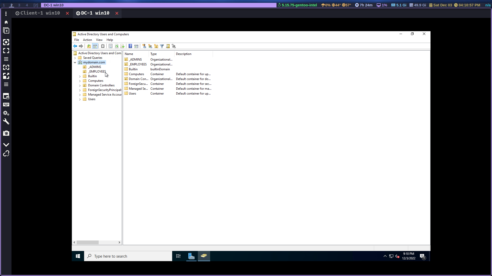

13. GO to "\_ADMINS" ou and create a new employee named "Jane Doe" (same password) with the username of "jane_admin"
14. Add jane_admin to the "Domain Admins" Security Group by right clicking her name, then click properties and go to the "member of" tab
  - Now click add and type domain, then check name and choose "domain admin", group click apply and ok

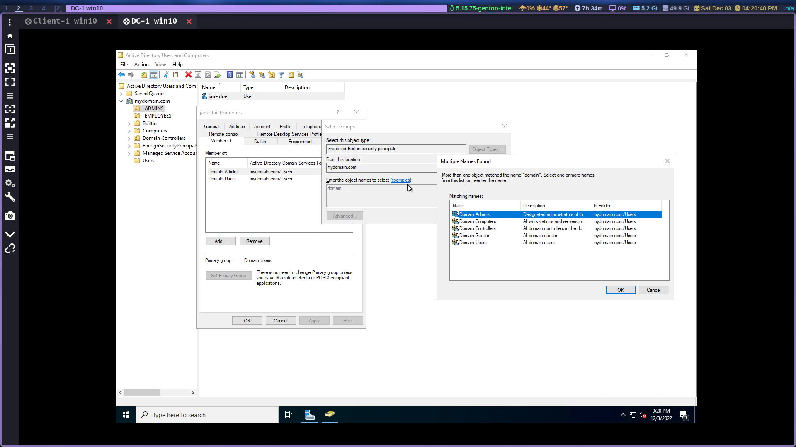

15. Log out/close the RDP connection to DC-1 and log back in as "mydomain.com\jane_admin"
16. Use jane_admin as your admin account from now on

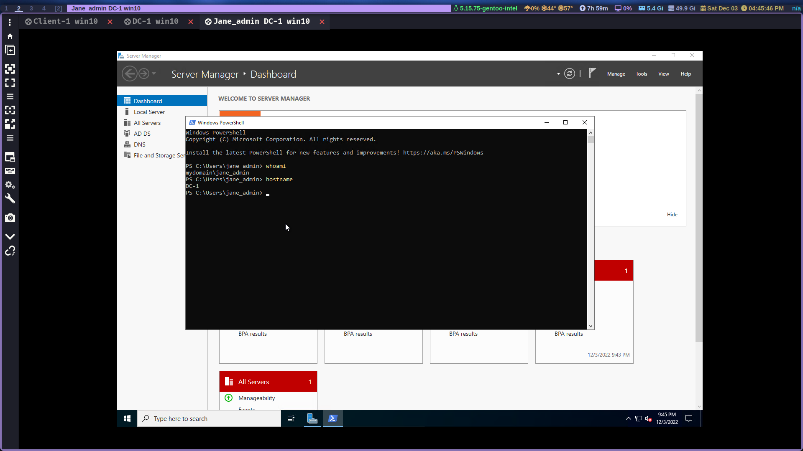

## Connect client-1 to your domain (mydomain.com)

17. From the Azure Portal, set Client-1's DNS settings to the DC's Private Ip by going to networking then clicking on the virtual nic athen going to dns servers option, then restart Client 1

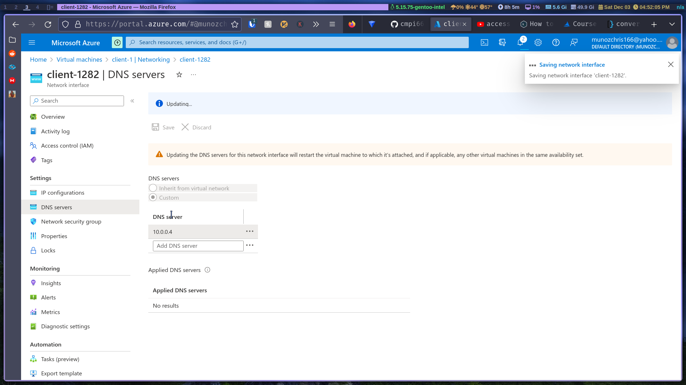

18. RDP into client-1 and join it to the domain by going to system settings, about, click "rename this pc", click change, choose domain and enter your domain

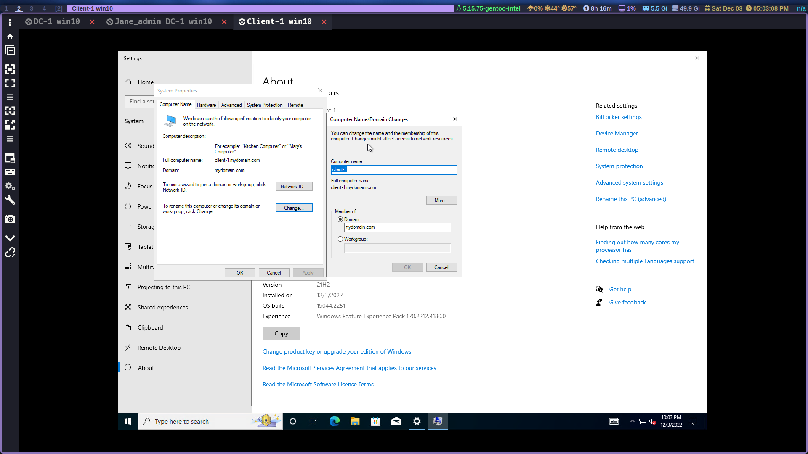

## Set up RDP for non-administrative users on Client-1

19. Log into Client-1 as mydomain\jane_admin and open system properties, click "Remote Desktop" then click "selec users that can remotely access this pc"
20. Allow "Domain Users" access to remote desktop

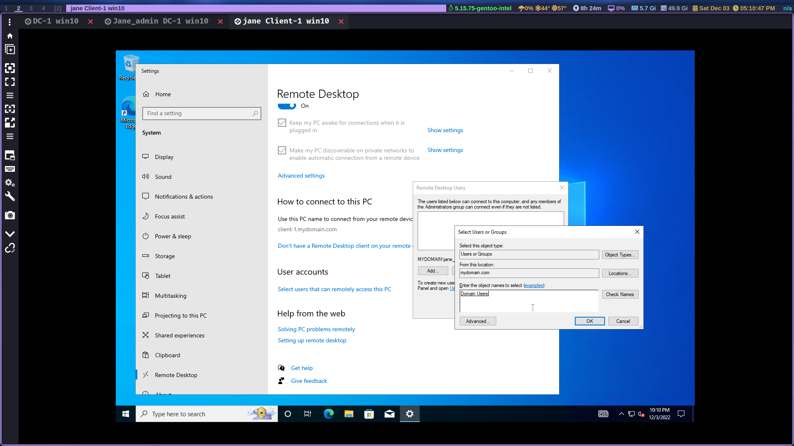
21. You can now log into Client-1 as a normal, non-administrative user

## Create additional users 

22. Login to DC-1 as jane_admin
23. Open PowerShell_ise as an administrator 
24. Create a new file and paste the contents of the [script](./generate-names-create-users.ps1)
25. Run the script by pressing the green play button and observe the accounts being created

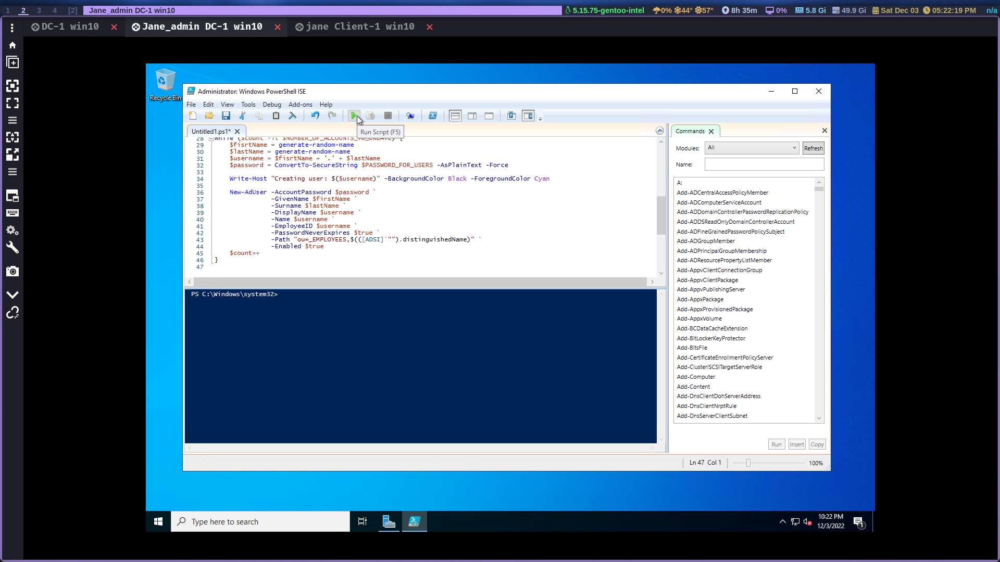

26. When finished, open ADCU and observe the accounts in the appropriate OU
27. Attempt to log into client-1 with one of the accounts (take note of the password in the script)

## Clean up our resources

Now that we're done and we learned how to set up Active Directory let's clean up our resources at Azure and delete all Resource groups and VM's. Make sure you verify resource group deletion. 

